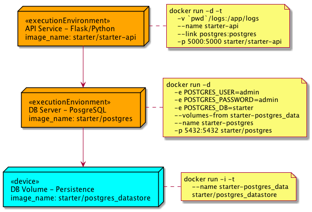

# Microservices using Docker
Flask-DB-Docker is a companion starter framework that associated with my post on [Existential Crisis with Microservices using Docker](https://bennycheung.github.io/existential-crisis-with-microservices-using-docker). This framework can be used to rapidly construct any data-oriented service with a database backend.

The technologies used by the starter framework composed of,
* Dockerize PostgreSQL <https://www.postgresql.org/> to run within a Docker container
* Dockerize API service written in Python/Flask <http://flask.pocoo.org/> that can communicate with the PostgreSQL
* Orchestrate the Dockerized containers by docker-compose <https://docs.docker.com/compose/> and established a link from the deployed service to the container running PostgreSQL


## Microservices Architecture
This example has been composed as the Microserivices Architecture style.
With this style, we could provide service components with a realistic compostability. We recommend to read the Martin Fowler and James Lewis's white paper on Microservice architecture. Their white paper goes much more in-depth for the drivers behind the [Microservice Architecture](http://martinfowler.com/articles/microservices.html)

Starter microservices documentations:
* [Starter API Documentation](starter-api/README.md)

## Docker Orchestration
We need to bring Docker up and running on the host.

Here is the deployment diagram, which is using Docker containers to deploy all services. The following sections provide detail instructions how to create and start Docker images to create the Starter microservices and their dependencies.



Following these steps to build all required docker images and bring up the application stack,
* Run `buildImages.sh` to build all required docker images
* Run `startStack.sh` to bring up the application stack
* If shutting down the application stack, run `stopStack.sh` will suspend the application stack
* If removing the application stack, run `teardownStack.sh` will delete all the application containers
* If removing all docker images, run `cleanupImages.sh` to leave no trace

To start a fresh application stack, 

```
./buildImages.sh
./startStack.sh
```

To shutdown and clear out the application stack,

```
./stopStack.sh
./teardownStack.sh
./cleanupImages.sh
```

To achieve any in-between application state or retaining the built docker images,
adjust the script running accordingly.

The following section shows the details of the dockerization, therefore optional to read.

----------------
### Persistent Volumes with Docker - Data-only Container Pattern
The main purpose of data container is to retain the `/var/lib/postgresql/data` persistent volume.
Since you may have multiple data container running on the same host, the method to overcome
docker recognized the image uniqueness is to give it an unique `README.md` file in the image.

-- Dockerfile --

```
FROM busybox
VOLUME /var/lib/postgresql/data

RUN mkdir /app
WORKDIR /app

ADD README.md /app/

CMD /bin/sh
```

To create the volume image:

```
cd busybox
docker build -t starter/postgres_datastore .
```

To start the volume image container:

```
docker run -i -t --name starter-postgres_data starter/postgres_datastore
```

Since the `starter-postgres_data` container likely won't ever need to be updated, and if it does we can easily handle moving the data around as needed, we essentially work-around the issues of losing container data and we still have good portability.

We can now create as many `starter/postgres_datastore` instances as we can handle and use volumes from as many `starter-postgres_data` style containers as we want as well (provided unique naming or use of container ID's). This can much more easily be scripted than mounting folders ourselves since we are letting docker do the heavy lifting.

One thing that's really cool is that these data-only containers don't even need to be running, it just needs to exist.

--------------------------
### Create Postgres DB Image
This is the creation of Posgres 10.2 docker images. Similar to the data-container image,
we have copied an unique `README.md` into the image so that docker will recognize it's uniqueness.
To prepare the image with `vim-tiny`, allows us to enter the container and perform some editing if needed.

-- Dockerfile --

```
FROM postgres:10.2

RUN apt-get update && apt-get install -y vim-tiny

RUN mkdir /app
WORKDIR /app

ADD README.md /app/

EXPOSE 5432
```

To create the DB image:

```bash
cd db
docker build -t starter/postgres .
```

To start the DB image container:

```bash
docker run -d \
    -e POSTGRES_USER=admin \
    -e POSTGRES_PASSWORD=admin \
    -e POSTGRES_DB=starter \
    --volumes-from starter-postgres_data \
    --name starter-postgres \
    -p 5432:5432 starter/postgres
```

Try connect to starter-postgres container,

```bash
psql -h localhost -U admin starter
```

-----------------------
### Create API starter-api Image
You can read the starter API microservices in [Starter API Documentation](starter-api/README.md).
This is a Python/Flask RESTful API implementation, with connection to the Postgres backend
to illustrate full CRUD operation on persistent data. Instead of automatically starting the Python application (see the commented out `ENTRYPOINT` and `CMD`), we shall start by the commandline.

-- Dockerfile --

```
FROM python:3.5

RUN mkdir /app
WORKDIR /app

ADD requirements.txt /app/
RUN pip install -r requirements.txt

ADD . /app

# If you want to start the Python application automatically, uncomment the following
# EXPOSE 5000
# ENTRYPOINT ["python", "manage.py", "runserver"]
# CMD ["-t", "0.0.0.0", "-p", "5000"]
```

To create the API image:

```
cd starter-api
docker build -t starter/starter-api .
```

To start the Starter API container:

```bash
docker run -d -t \
    -v `pwd`/logs:/app/logs \
    --name starter-api \
    -p 5000:5000 starter/starter-api \
    python manage.py runserver -t 0.0.0.0 -p 5000
```


### Import Medical Procedure Codes into DB
For importing the medical procedure codes, we would like to start an `starter/starter-api` instance. However, this instance needs to be in the same Docker network as the current running network.
When we started the stack, a network called `flask-db-docker_default` was created.
To confirm this, we can run `docker network ls`.

    $ docker network ls

    NETWORK ID          NAME                      DRIVER              SCOPE
    e337657076ec        bridge                    bridge              local
    88cc0cfe1cc7        composer_default          bridge              local
    945ac8820956        flask-db-docker_default   bridge              local
    7749efcaa3dc        host                      host                local
    0c4c4f14a186        none                      null                local

We should see the `starter-postgres` and `starter-api` are part of the `flask-db-docker_default` network,

    $ docker network inspect flask-db-docker_default

    ...
    "Containers": {
        "b43291da217f705ea3d1676fb757b1dafc7c8fdf18f2df32d441e248a6ab8b31": {
            "Name": "starter-postgres",
            "EndpointID": "d01bdf7da8de378b51928a7e7e2a55fab6995865ea5d1c7793e9923c9409f287",
            "MacAddress": "02:42:ac:1d:00:03",
            "IPv4Address": "172.29.0.3/16",
            "IPv6Address": ""
        },
        "e05d5fba146fc4f1c018df41f1cae6bf4fe3d54395572cd73b2c3a3c9bbf859b": {
            "Name": "starter-api",
            "EndpointID": "19e27585ae2005d6310bc6ec8dfbfe8a405400cb4196bfd90206a1fbd9f5700c",
            "MacAddress": "02:42:ac:1d:00:02",
            "IPv4Address": "172.29.0.2/16",
            "IPv6Address": ""
        }
    }

Then we shall start an instance of `starter-api` container to join the `flask-db-docker_default` network,
so that we can access to the same `starter-postgres` database connection.
We shall start a interactive shell `-ti` /bin/sh. The container will be automatically
destroyed after running by `--rm` remove container parameter.

```bash
docker run --rm -ti --network flask-db-docker_default starter/starter-api /bin/sh
```

After we enter the container, we can execute the initial `starter` database creation
by running the following commands in `starter-api/startup` folder.

```bash
python manage.py resetdb
```

We create a new user `admin` with the password `admin` (of course this is not secure).

After the database has been created, we can exercise the database by inserting all the medical procedure codes from the `tex-api/startup` folder.

```bash
docker run --rm -t \
    --network flask-db-docker_default \
    -v `pwd`/starter-api/startup:/app/startup \
    starter/postgres /bin/bash -c \
    "PGPASSWORD=admin psql -h starter-postgres -U admin starter < /app/startup/starter_pxcodes.sql"
```

We can get the medical procedural data from the `starter-api` that we have loaded.

```bash
http --auth admin:admin http://localhost:5000/api/v1.0/pxcodes/
```

You should see the paged JSON response of 100 medical procedure codes.

```
HTTP/1.0 200 OK
Content-Length: 15973
Content-Type: application/json
Date: Thu, 27 Sep 2018 22:18:00 GMT
ETag: "678ca404a51794f10b8747ea1eeb4959"
Server: Werkzeug/0.9.6 Python/3.5.6

{
    "items": [
        {
            "procedure": "EXTRACRANIAL PROCEDURES W/O CC/MCC",
            "pxcode": "039",
            "url": "http://localhost:5000/api/v1.0/pxcodes/039"
        },
        {
            "procedure": "DEGENERATIVE NERVOUS SYSTEM DISORDERS W/O MCC",
            "pxcode": "057",
            "url": "http://localhost:5000/api/v1.0/pxcodes/057"
        },
        ... skipped ...
    ],
    "meta": {
        "first": "http://localhost:5000/api/v1.0/pxcodes/?per_page=100&page=1",
        "last": "http://localhost:5000/api/v1.0/pxcodes/?per_page=100&page=1",
        "next": null,
        "page": 1,
        "pages": 1,
        "per_page": 100,
        "prev": null,
        "total": 100
    }
}

```
